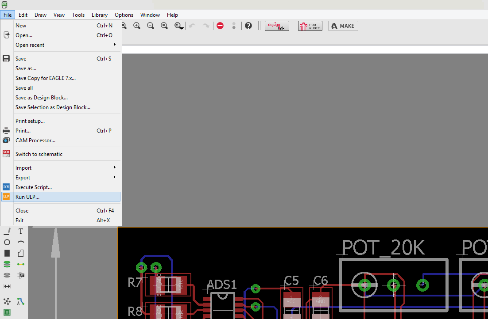
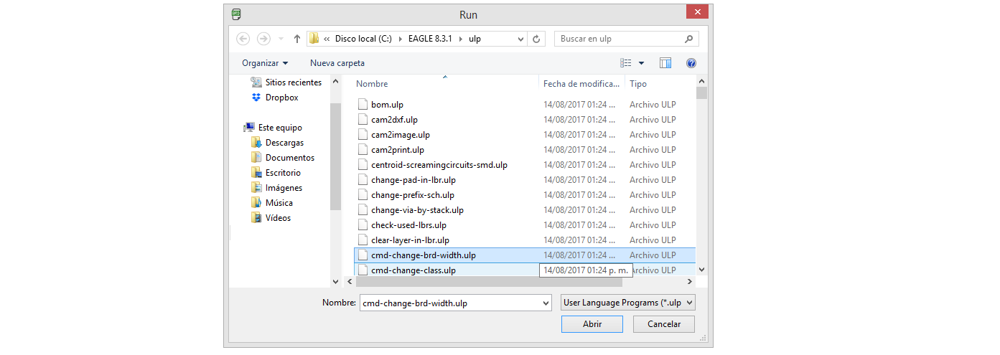
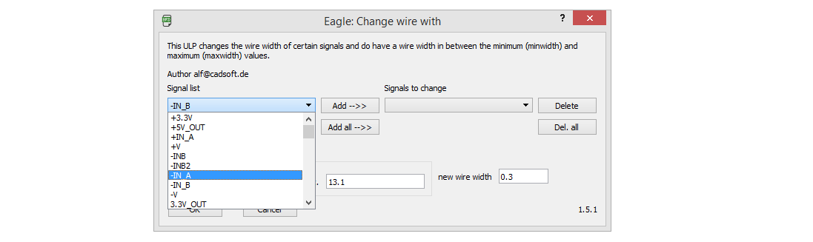
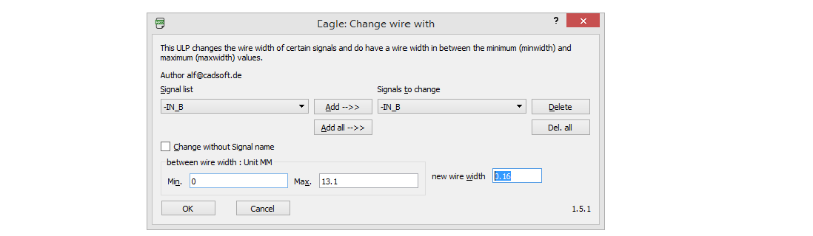

# Cambiar las propiedades de un grupo de pistas selectas en Eagle CAD

- [Cambiar las propiedades de un grupo de pistas selectas en Eagle CAD](#cambiar-las-propiedades-de-un-grupo-de-pistas-selectas-en-eagle-cad)
  - [Introducción](#introducci%c3%b3n)
  - [Archivo o extensión ULP](#archivo-o-extensi%c3%b3n-ulp)
  - [Metodología](#metodolog%c3%ada)

## Introducción

Una de los errores típicos que se prsentan al usar una herramientas de diseño de **PCB** es hacer cambios en algunas de las propiedades de los elementos que se usan, llámese pistas, vías, pads o incluso dispositivos; que se usan a lo largo de un proyecto. Esto podría sonar irrelevante pues, cuando un cambio de estos es necesario recurrentemente se usa el procedimiento de _click derecho_ sobre el elemento a cambiar, seleccionar _propiedades_ y cambiar a una configuración conveniente. Sin embargo, esta metodología queda obsoleta cuando la tarea de cambiar las propiedades no se limita a uno o dos elementos, sino a un grupo grande de ellos. Para resolver ese problema se presenta una alternativa que ayuda a reducir horas de trabajo que son ocupadas al estar cambiando cada una de las propiedades de un grupo grande.

## Archivo o extensión ULP

Una de la opciones que ofrece *Eagle CAD* para trabajar con varios elementos es usar un archivo o extensión **ULP**, esto de sus siglas en inglés ***User Language Program***. Estos archivos, de la categoría de desarrollo, son usados para facilitar rutinas de trabajo. La raíz de su funcionamiento se basa en un lenguaje de programación, C. Son desarrollados y compartidos a la comunidad en plataformas como *Eagle AUTODESK* [eagle AUTODESK](http://eagle.autodesk.com/eagle/ulp), de donde se puede buscar y descargar algún archivo que entre sus descripciones cumpla con algún requerimiento personal.

## Metodología

Para detallar el desarollo de la metodología en este ejemplo, se hará un enfoque en modificar el ancho de casi todas las pistas de todo el diseño de un *PCB*, estas son alrededor de 400 pistas, y están distribuídas a lo largo de una placa de 10cm x 10cm, en dos capas.

1. Buscar el ULP

    Entonces lo primero que hay que hacer es buscar la opción **Run ULP**. Esta opción se encuentra cuando se accede a *File*, y seleccionanando el icono trazado con amarillo, ULP. Ver *figura 1*.

    

2. Seleccionar la extensión ULP correcta

   Una vez se ha seleccionado la opción ULP, se mostrará una venatana de búsqueda, similar a la figura 2*. En esta se debe seleccionar la opción de **cmd-change-brd-width.ulp**. Al decir verdad el nombre es muy explícito, la función que hace es cambiar el ancho de las pistas.

   

3. Seleccionar las pistas a cambiar

   Cuando se está trabajando en Eagle CAD, se sabe que un elemento puede unirse con otro cumpliendo una condición: *"Que los elementos a unir compartan el mismo nombre"*. Si se cumple con esta condición, se pueden unir dos o más elementos, pues coinciden con el mismo nombre. A estas líneas que los unen, en el archivo *esquemático*, o pistas que lo hacen, en el archibo *board*; se les conoce como señales. Así que, si se cambian las propiedades de una señal del archivo *.brd (board)*, se cambiarán consecuentemente las propiedades de todas las pistas que tengan el mismo nombre y esto es justo lo que se busca, con ello se puede cambiar la propiedad de ancho de varias pistas en una sola acción.

   Entonces el paso a seguir es seleccionar el nombre de las señales que se desean cambiar sus propiedades. Como se planteó en la metodogía, lo que se busca es cambiar el ancho de casi todas las pistas. Por lo tanto se va seleccionar la opción de "*Add all -->>*". Y puestas todas las señales se seleccionan las que no cambiarán y se elimina con "*Delate*".

    

4. Escoger el nuevo ancho de la señal

    Una vez seleccionadas las señales se procede al paso final. Lo último por hacer es escoger el nuevo ancho de las señales. Todas las pistas están con un ancho de 0.15mm entonces, se escoge un ancho diferente, un 0.16mm por dar un ejemplo, que entra dentro del rango de 0mm a 13.1mm. Esta metodología se termina con presionar el botón ***ok***.

    
